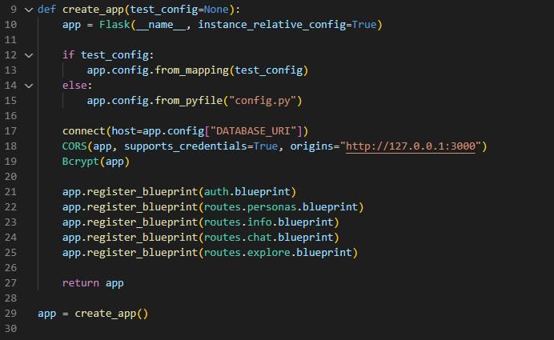
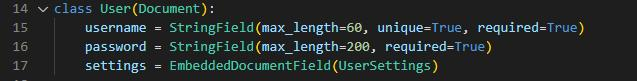
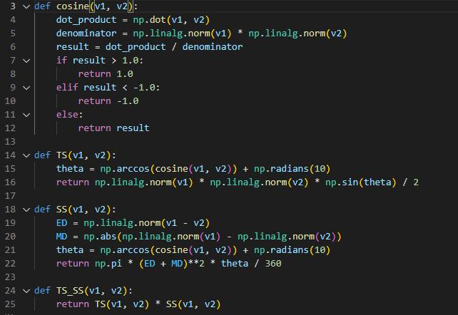
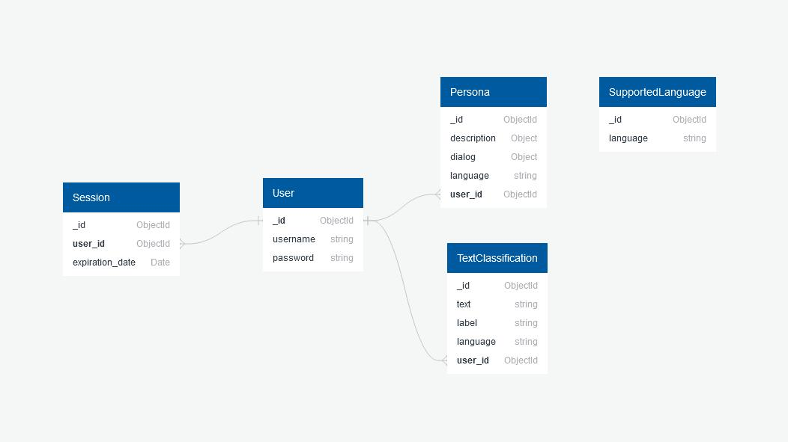

# NLP Server

This git repository is part of a project that implements a chatbot which
impersonates a patient who suffers from cardiovascular diseases.

The project consists of three repositories which contain the logic of the
application:

- Client [nlp-ui](https://github.com/eduard-gp/nlp-ui)
- Server (**this repository**)
- AI [nlp-ai](https://github.com/eduard-gp/nlp-ai)

## Application Arhitecture

The application has an arhitecture of client-server. There are three components:
a user interface, a web server and a database. The user interacts with the
chatbot using the UI. It is possible to perform the following actions:

- Login
- Create a new patient
- Modify the information of a patient that already exists
- Interact with a patient

The following image describes the workflow of the application:

## Server

The server is written in python usign Flask which is a micro framework that was
designed to be easy to use and in the same time be able to scale for complex
applications. A WSGI (Web Server Gateway Interface) in Flask has to instantiate
a Flask class to which it will be attached a configuration. The function
`create_app()` encapsulates the logic of creating a Flask application.

The Flask instance is passed the name of the module and the True value for the
second parameter which specifies that the configurations files should be
specified with a relative path. This is a good practice to avoid security risks.
If the function isn't called with a configuration for testing then the
"config.py" file is read. This file contains the configuration for the
"SECRET_KEY" which is used to sign the session cookies and "DATABASE_URI" which
is used to establish the connection to the database. CORS (Cross-Origin Resource
Sharing) is used because the UI is served by a different endpoint. CORS uses
HTTPS-headers to allow the server to inform the browser what origins are safe in
order to loard their resources. Bcrypt is a hashing algorithm which is
recommended for hasing passwords. On lines 21-25 the blueprints are registered.
The blueprints are a concepts specific to Flask applications. They simplify how
applications are created and offers a way to register operations.

#### Blueprints

The operations for a user authentication are implemented in the "auth" module by
creating a blueprint. The following endpoints are defined:

- /auth/signup
- /auth/login
- /auth/logout
- /auth/islogged

The database interface module was implemented using MongoEngine which is an
Object-Document Mapped written in python for MongoDB.

The chat blueprint has the following endpoints:

- /chat/utterance

This endpoint is used to analyze a user's question in order to offer an answer.
The user has to be logged in to do this opearation.

The personas blueprint has the following endpoints:

- /personas
- /persona/update
- /persona/insert

This endpoints enable a user to modify the data associated with his account. The
user has to be logged in to do these operations.

The explore blueprint has the following endpoints:

- /explore/analyze

The endpoints will responde with a complete analyze for a question. The response
will contain the question's intention, the confidence for the made choice and
the tokenized sentence with entity tags coupled to every token. The user has to
be logged in to do this operation.

The info blueprint has the following endpoints:

- /info/languages
- /info/labels

The endpoints offer information about the supported languages and entity tags
that are used to classify a token from a sentence.

The ML module for natural language processing defines how the output of a deep
neuronal network is used to select an answer to a question. For more information
about how the model was train see [nlp-ai](https://github.com/eduard-gp/nlp-ai).
A ML model is selected depending on the language used or the task that has to be
executed: text classification or named entity recognition. For the task of text
classification the output of the deep neuronal network is the intention of the
question and the vectorial codification of the question. Because a patient can
have multiple answers to a question, we have to select the one that fits the
best. The similarity between answer and question is computed using TS-SS
(Triangle Area Similarity - Sector Area Similarity). This functionality is
encapsulated be the function `TS_SS()`.

The data used by the application is stored in the database using the following
scheme:

